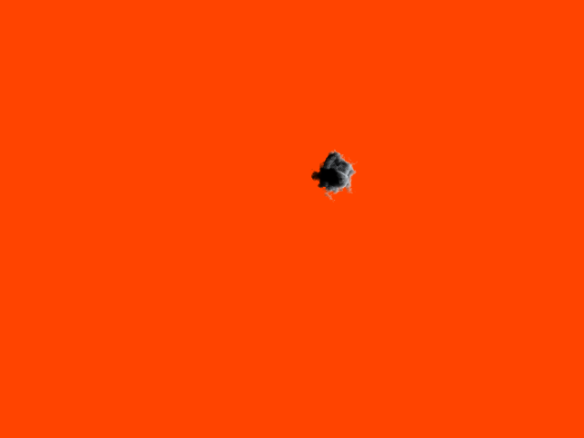

volume-rendering
================
1).	image1: Basic rendered cloud.
		single color, pos@(200, 0, 0) RGB=(1, 1, 1)
		radius = 20
		Octave = 6
		Amplitude = 1.0
		Frequency = 0.05
		Seed = 3
	
2). image2: For comparing the effect of splatting the density to neighbor voxels.		
		single color, pos@(200, 0, 0) RGB=(1, 1, 1)
		radius = 20
		Octave = 6
		Amplitude = 1.0
		Frequency = 0.05
		Seed = 3
		
		Splatting function at line 1081 - 1117
		The function will splat out the current density to the 6 nearest voxels and 12 second nearest voxels. 
		According to the distance from the original voxel, the neighbor voxels would get different density. 
		
			
3).	image3: quad cloud_cotton like image.
		radius = 20
		Octave = 6
		Amplitude = 0.5
		Frequency = 0.05
		Seed = 1
		
		Create quad or quad cloud shape function at line 1019 - 1070
		Using "quad" as type name to produce a quad density, and using "quadcloud" to produce the cotton like texture.

4). image4: Pyroclastic with 3 different colors. 
		1st color, pos@{200 ,0,0} RGB@(1, 1, 1)
		2nd color, pos@{-200,0,0} RGB@(0, 0, 0.8)
		3rd color, pos@{0, 200,0} RGB@(0.8, 0, 0)
		radius = 5
		Octave = 6
		Amplitude = 1.0
		Frequency = 0.05
		Seed = 3
		
		You could add more light sources by modifying line 46-68 , 211-221.
		To produce multi light source is at line 650-658

5). image5: 
		a)Multi material color. 1st material color is defined in the config file. 2nd material color is set in line 
			To create multi material color is at line 665-705. 
			You could turn off the multi material color function by set the "doMultiMaterialColor" at line 72 to false.
		
		b)Gradient background color
			Set second background color at line 70.
		  Create gradient background color at line 734-736
		
		
		
		When I played with the parameters of the Perlin noise, I noticed some noteworthy characters.
		-First, when the Octave value is greater than 3, the variation of Octave would not cause much difference
		-The bigger the Frequency value, the smaller the cloud particle. For create the cloud like image, the best choice of the frequency value is between 0.05 ~ 0.2
		-The bigger the Amplitude value, the more disorder of the cloud
